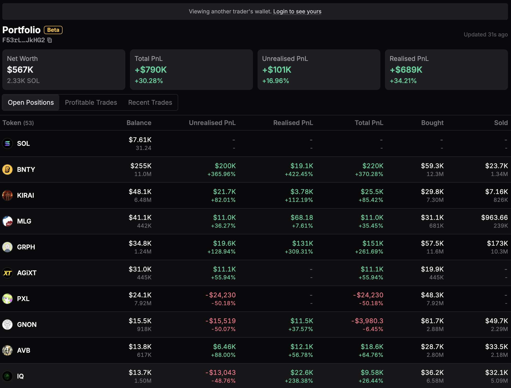

<head>
    <title>Ape Pro: Portfolio</title>
    <meta name="twitter:card" content="summary" />
</head>

The Portfolio section is a feature that allows you to gain a complete overview of your holdings and performance. 

---

## Portfolio Metrics

| Metric | Description |
|--------|-------------|
| Net Worth | View your total holdings in USD and SOL denominations. |
| Total PnL | View your overall profits or losses in the tokens, inclusive of unrealised and realised PnL. |
| Unrealised PnL | View your PnL before you sell the tokens. |
| Realised PnL | View your PnL after you have sold the tokens. |

:::info
You can also get more information about your Portfolio's tokens and positions in the table below the Portfolio Metrics.

The table includes open positions, profitable trades (realised PnL), and recent trades.
:::