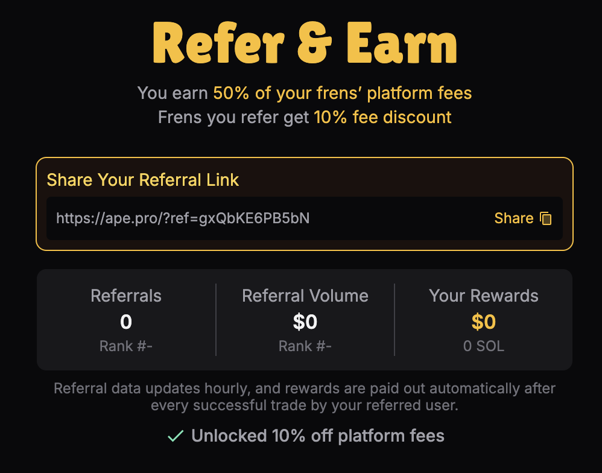

<head>
    <title>Ape Pro: Referral</title>
    <meta name="twitter:card" content="summary" />
</head>

Ape Pro offers a Referral Program to reward users for inviting ape friends to the platform. Your invite reward you and your friend.

---

## For Referrers

**Earnings**: Earn 50% of the platform fees from your referees.

**How to get Referral Link?** The Referral page is accessible via the Refer button on top right.

:::info
You will need to activate your Ape Pro account (by depositing 0.1 SOL minimally) to generate a referral link to share with your friends.
:::

## For Referees

**Discount**: Receive a 10% discount on platform fees (undiscounted fee is 0.5%) when signing up through a referral link.

**Activation Requirement**: Deposit a minimum of 0.1 SOL to activate your account and start earning referral fees.

:::info
The referral link format is `https://ape.pro/?ref=[referral_id]`.
:::
