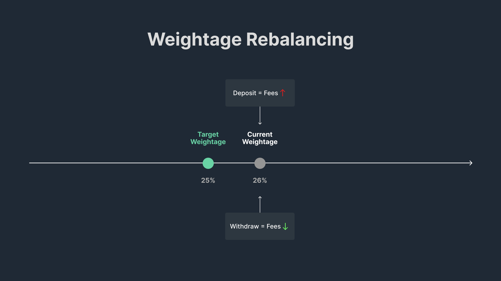

<head>
    <title>How $JLP Works: Key Insights on Liquidity & Yield | Jupiter Station</title>
    <meta name="twitter:card" content="summary" />
</head>

### Liquidity Pool

The Jupiter Perpetuals exchange is a trader-to-LP exchange which means traders borrow tokens from the liquidity pool (the JLP pool) for leverage.

Instead of periodic funding payments between long and short traders, Jupiter Perpetuals implements an hourly borrow fee mechanism. 

Traders pay these fees to the pool based on the amount of tokens they've borrowed. This mechanism helps secure the balance of the pool's assets and compensates liquidity providers for the use of their tokens.

### Add/Remove Liquidity into JLP

When a user adds liquidity to the JLP pool, they increase the amount of TVL (Total Value Locked) which increases the liquidity available for perps trading. The pool is currently a collection of the following tokens: **USDC, USDT, SOL, wBTC and ETH**.

**Adding Liquidity** 

Any Liquidity providers (LPs) can acquire JLP by swapping for it on Jupiter Swap. Jupiter Swap will find the best price to acquire JLP for you, automatically. This can either be purchasing it off the open market, or swapping it for a desired asset and depositing that into JLP directly. Use Jupiter Swap for a frictionless experience of getting JLP. While JLP is still being minted, your assets may be deposited into the relevant token pool increasing the current weightage. At the point of depositing assets into the JLP pool, the protocol will re-price the TVL in the USD value.

**Removing Liquidity** 

JLP can also be sold via Jupiter Swap. Simply swap JLP for your desired asset. The JLP token could either be transferred to another trader or may be redeemed by the JLP pool, burning the JLP token, and releasing some of the currency contained in the pool.

**Purchasing/Exiting JLP** 

The best way to purchase or exit JLP is via [Jupiter Swap](https://jup.ag/swap/USDC-JLP).

When using Jupiter Swap or programs that integrate Jupiter Swap, the minting and burning of JLP tokens occur automatically. When you swap in and out of JLP, Jupiter Swap will find the best route to mint/burn JLP automatically, or swap through other DEXes if the route offered is better.

:::info
This automatic minting/burning mechanism is unique to Jupiter Swap and programs that route via Jupiter Swap. If you're interacting directly on a different DEX, you will trade JLP at the price offered by the DEX instead of the virtual price of JLP.

**Only the Jupiter Perpetuals program (which is integrated in Jupiter Swap) has the authority to mint and burn JLP tokens.**
:::
### Yield Generation

The exchange generates fees and yields in various ways:

- Opening and Closing Fees of Positions (consisting of the flat and variable price impact fee).
- Borrowing Fees of Positions
- Trading Fees of the Pool, for spot assets
- Minting and burning of JLP

**75% of the fees generated by JLP go into the pool.** The fees are compounded into the pool hourly. 

:::info Yield Calculation Factor
It is essential to note that pool earnings and losses (index token appreciation/depreciation) are not factored in the overall yield calculation.
:::

### Fee Calculations

| Action             | Fee                                                                        |
| ------------------ | -------------------------------------------------------------------------- |
| Opening a Position | 6 BPS                                                                      |
| Closing a Position | 6 BPS                                                                      |
| Price Impact Fee   | Variable (see [reference](../8-perpetual-exchange/2-how-it-works.md#price-impact-fee)) |
| Swap Fee           | Between 0 BPS to 150 BPS depending on pool weightage                       |
| Borrow Rate        | 0.8 / 1.0 BPS per hour (see below) x token utilization percentage                    |

:::info
**Hourly Borrow Rate** is set at 0.008% for SOL, ETH and BTC, while the rate for USDC and USDT is set at 0.01%.
:::

Fee calculation for opening and closing positions involves the volume of these transactions, multiplied by the fee percentage of 0.06%.

The price impact fee from larger trades are then added. More analytics on this to follow.

The borrowing fee, often termed the hourly borrow fee, is computed as follows:

```
hourly borrow fee = (tokens borrowed / tokens in the pool) x 0.008% x position size
```

The swap fee for the pool typically ranges between 0% and 2%.

### Estimating Yield

To provide an estimated perspective, you can calculate potential revenue by taking the Jupiter Perpetual Exchange's daily or weekly total volume and multiplying it by a fee percentage. For instance:

- Total Daily Volume: 50 million
- Fee Percentage: 0.06%
- Price Impact Fees: Minimum 0.01%
- Revenue Share Percentage: 75%

Using these values (excluding price impact and hourly borrow fees), the estimated calculation would be as follows:

Total estimated revenue to be deposited into JLP pool:

```
$50M x 0.06% x 75% = $22,500
```

To determine your specific share or weight in the total JLP pool, use the following formula:

```
your_pool_contributed_amount / total_pool_amount x 100 = your_pool_percentage
```

For example:

- Your contribution: $1,000
- Total pool amount: $4,000,000
- Your share percentage: 1,000 / 4,000,000 x 100 = 0.025%

Finally, you can calculate your estimated generated revenue share by multiplying the results of the first and second calculations:

```
estimated revenue share you generate = $22,500 x 0.025% = $5.625
```

### JLP Fee Distribution and APR Calculation

#### Fee Distribution

##### 1) Hourly Fee Distribution

Fee distribution into the JLP token occurs at the start of every hour, in UTC time (e.g. `00:00 UTC`, `01:00 UTC`, `02:00 UTC` and so on). 

During this process, 75% of realized fees are withdrawn from each custody account's ```assets.fees_reserves``` and deposited back into the pool, while the remaining 25% is sent to Jupiter as a protocol fee.

:::tip
Learn more about the on-chain accounts associated with JLP & Jupiter Perpetuals [here](../8-perpetual-exchange/3-onchain-accounts.md).
:::

##### 2) Weekly APR Updates

The JLP pool maintains a ```pool_apr.last_updated``` field, which records a UNIX timestamp of the latest APR update. After a **consecutive week** of hourly fee distributions have passed, Jupiter calculates the new APR and updates the ```pool_apr.fee_apr_bps``` value accordingly.

**APR Calculation**

APR for the JLP pool is updated weekly, and can be calculated using the following formula:

```
if current_time > (last_updated_time + 1_WEEK):
    time_diff = current_time - last_updated_time
    // 10_000 represents the scaling factor used to calculate the BPS for the pool's APR
    apr_bps = (realized_fee_usd * YEAR_IN_SECONDS * 10_000) / (pool_amount_usd * time_diff)
```

### Risks Associated with Holding JLP

1. **Bull Markets**

During a bull market, JLP may not outperform SOL, ETH, or BTC. This is because the pool is made of a mix of stable and non-stable tokens. 

2. **Profit and Loss (PnL) Dynamics**

Traders' PnL from perpetual trading impacts the JLP pool. If a trader incurs a net positive PnL, the losses are sourced from the JLP pool to compensate the trader. Conversely, if a trader's PnL is a net negative, the gains are deposited into the JLP pool for LP holders.

**Long Trade Scenario:** If the trader profits on the long, the JLP pool will lose in token quantity but not in USD value because the underlying token value in the pool appreciates in value as well.


**Short Trade Scenario:** If the trader profits on the short, the JLP pool will lose some of the stablecoins but the shorted token will remain the same. This causes a net USD loss on the Pool.


*This [research article](https://skribr.io/app/article/exploring-jupiters-perpetual-futures-a-comprehensive-research-analysis/) from LeeWay provides more detail on how this works.*

3. **Token Price Fluctuations:** The JLP pool consists of both stable and non-stable tokens. Fluctuations in token prices can affect the value of JLP. As a result, users may find that their withdrawn tokens can be worth less compared to their initial deposit. Additionally, deposit and withdrawal fees for the JLP Pool may further reduce the number of tokens withdrawn, particularly for shorter holding periods.

**Can JLP go down?** Yes. As shown in the trader profiting on a short trade, JLP in USD value will go down when the fees generated are lower than depreciation of assets and payout from traders' profit.

### Pool Weightage

In the JLP pool, each asset is assigned a **target weight**, which is set by the team. 


Jupiter works with [Gauntlet](https://www.gauntlet.xyz/) and [Chaos Labs](https://chaoslabs.xyz/) to conduct regular risk assessments and market analyses in response to the evolving market conditions. These assessments are also discussed with the community before they are presented to the team for rollout. 

:::tip
 The risk assessments can be accessed via **[Jupiter's research forum](https://www.jupresear.ch/tag/risk)**.
:::

### Maintaining Target Weight

The weightages of each asset in the JLP pool will differ based on market activity, particularly Spot Trading or Deposit & Withdrawal of assets into JLP.

To help maintain the Target Weight, JLP dynamically sets a Swap Fee or Mint/Redeem Fee.

**Example: $USDC**

- If the current weightage of USDC is **higher** than its advised target weightage, USDC deposits into the JLP Pool will incur additional fees, while USDC withdrawals will receive a fee discount.
- If the current weightage of USDC is **lower** than its advised target weightage, USDC deposits into the JLP Pool will receive a fee discount, while USDC withdrawals will incur additional fees.



Simply put: Transactions that shift an asset’s current weightage **further away** from the target weightage incur additional fees while transactions that shift it **closer to** the target weightage will receive a discount on fees. This is based on the fee incurred when minting or burning JLP during the swap. 

This allows JLP to maintain its target weight as liquidity providers are incentivized to maintain the target weightage amid high volumes of spot trading or deposit/withdrawal activity.

### Failsafe Mechanism

***How far can the current weightage of an asset deviate from its target weightage?***

An asset’s current weightage can deviate from its target weightage by a maximum of **20%** of the target weightage value.

**Example:**

- If the advised target weightage of **USDC** in the JLP pool is **26%,** the current weightage of the asset in the JLP pool can deviate between a range of **20.8%** (-20%) and **31.2%** (+20%).
- This means that USDC cannot be deposited into the pool if the current weightage goes above **31.2%**, and USDC cannot be withdrawn from the pool if the current weightage goes below **20.8%**.

This means that during a Black Swan event where a JLP asset depegs, the maximum loss is `Target Weight * 1.2`.
