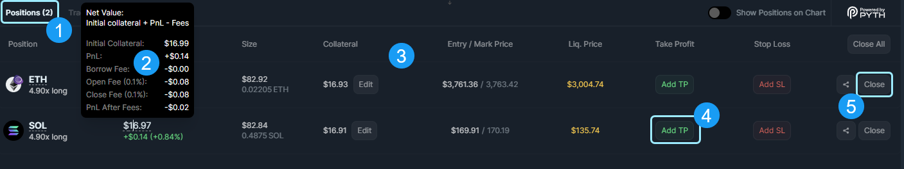
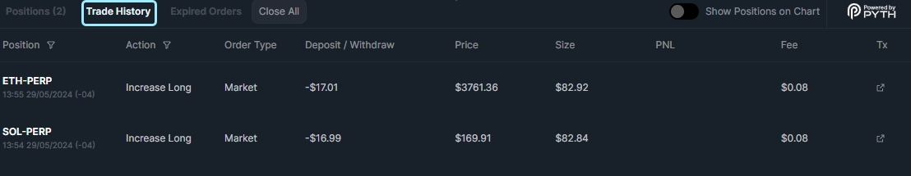

<head>
    <title>Understanding Jupiter Perps: Trading on Solana</title>
    <meta name="twitter:card" content="summary" />
</head>

The **Jupiter Perpetuals** decentralized exchange allows traders to open leveraged (up to 100x) long and short positions for the following tokens:

* [**SOL**](https://jup.ag/perps/long/SOL-SOL)
* [**ETH**](https://jup.ag/perps/long/SOL-ETH)
* [**wBTC**](https://jup.ag/perps/long/SOL-WBTC)

Traders can deposit or withdraw collateral to manage their position, and close their positions fully or partially. The Jupiter Perpetuals exchange uses price oracles for token prices. So, large trades will not incur price impact like traditional derivatives platforms.

Liquidity for the Jupiter Perpetuals exchange is provided by the [JLP Pool](https://jup.ag/perps-earn), which holds **SOL**, **ETH**, **wBTC**, **USDC**, and **USDT** as the underlying tokens. The pool provides attractive returns for liquidity providers, while providing ample liquidity for traders to open highly-leveraged positions.

:::info Statistics Dashboards
You can find various metrics on Jupiter Perpetuals on the following dashboards:
1. [Chaos Labs Dashboard](https://community.chaoslabs.xyz/jupiter/risk/overview)
2. [Gauntlet Dashboard](https://app.gauntlet.xyz/protocols/jupiter)
3. [Dune Analytics](https://dune.com/jupiterexchange/jupiter-perps)
:::

## Perpetual Trading Interface

1. **Perpetual Trading Tab:** This is where all the trading action happens. You can trade long or short on the three main blue-chip markets we offer: SOL, ETH, and WBTC, with leverage of up to 100x.
2. **Earn Tab:** This is where passive users can participate. Users can join the liquidity pool and earn passive fees generated from trading activities. (For information on the earn tab and the liquidity used by perpetuals, head over to [JLP](/guides/jlp)).
3. **Perp Market Selector:** Currently, we only support the three main blue-chip markets: SOL, ETH, and BTC.
4. **Price Stats:** Here, you can find a quick overview of the current real-time stats, including the current index price, 24-hour price movement, 24-hour highs, and 24-hour lows.
5. **Long/Short Selector:** Choose whether you want to go 'Long' or 'Short' on the respective market.
6. **Input Token Selector:** This is the input section where you can select any SPL token to use as collateral to enter a position.
7. **Leverage Slider:** Here, users can increase their trading size with leverage ranging from 1.1x to a maximum of 100x.
8. **Order Summary:** This section provides an order summary with all the information and stats calculated. (Please review and confirm your order before submitting the transaction).

---

## Positions Tab

1. **Positions Tab:** The Positions tab is where you can view and manage all your current open positions.
2. **Value Display:** Shows the value of the currently open positions. By hovering over the number value of your position you can see the overall position details. This includes the fees being incurred by your trading actions, such as: opening, closing, and borrowing.
3. **Size:** Size indicates the current size of your positions factoring in the leverage as well. It's calculated as the initial collateral amount multiplied by the leverage level.
4. **Collateral:** This is the initial amount you provided when opening your long or short position. You can use the `Edit` Button to add or remove collateral to more closely manage your positions.
5. **Entry / Mark Price:** The entry price indicates the price at which the position was opened. The mark price indicates the current market price of the position asset.
6. **Liquidation Price:** The liquidation price is the threshold at which the mark price reaching this level triggers liquidation. This process is to repay any loan associated with opening the position.
7. **Take Profit:** Set up a Take Profit order for your position. A take profit order is a conditional sell order set by the user to close a position if it reaches a specified price level. This is a common way to secure profits on a winning trade at pre-defined price levels.
8. **Stop Loss:** Set up a Stop Loss order for your position. A stop loss order is a conditional sell order set by the user to close a position if it reaches a specified price level. This is a common way to limit losses on trades.
9. **Close Positions / Share:** Immediately close all positions or individually close positions, securing gains or losses at the current market price.

---

### Trade History Tab

The Trade History tab is where you can review all your past actions and activities that have occurred with your open positions and orders.

1. **Position:** This column represents your position where the action or event was triggered, along with the current market ticker and the timestamp of when it occurred.
2. **Action:** In the Action column, you can see the specific action or event that occurred for the respective position.
3. **Order Type:** This column indicates the type of order that occurred for the position. For example, it could be Market, Trigger, or Liquidation.
4. **Deposit / Withdraw:** Here, you can find the amount that was either deposited into or withdrawn from the position.
5. **Price:** The Price column displays the mark price at which the action or event occurred, triggering the action order.
6. **Size:** This column reveals the size of the position that triggered the action or event.
7. **PNL:** The PNL column shows the Profit and Loss associated with the position.
8. **Fee:** In this column, you can find a transaction link to the action or event that took place on-chain.
