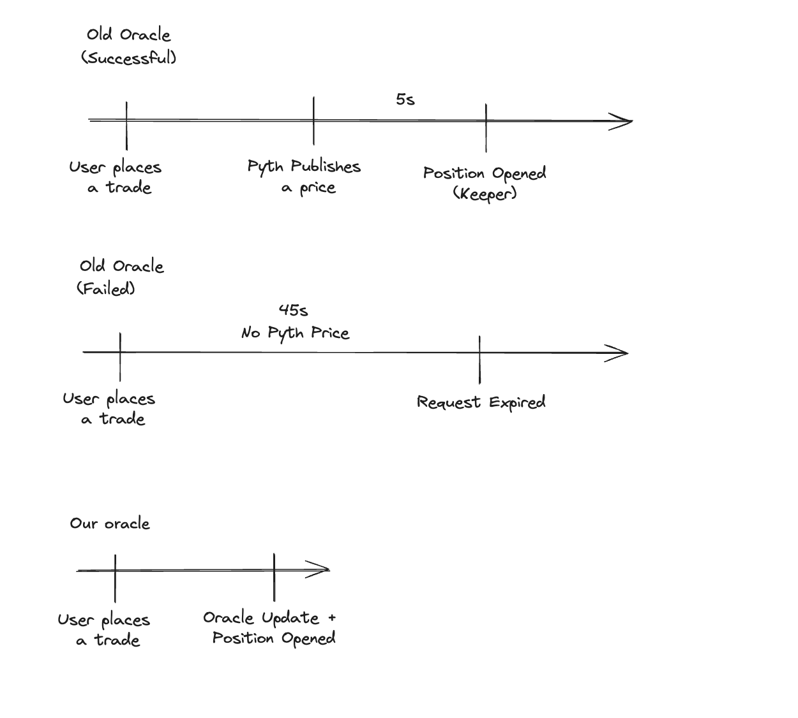

<head>
    <title>Understanding How Jupiter Perps Works: Complete Guide</title>
    <meta name="twitter:card" content="summary" />
</head>


Jupiter Perps is a **LP-based perpetual exchange** based on oracle prices.

Our pool consists of 5 tokens, **SOL**, **ETH**, **WBTC**, **USDC**, and **USDT**. Users acquire JLP by swapping on [Jupiter Swap](https://jup.ag/swap/USDC-JLP). Jupiter Swap automatically finds the cheapest way of acquiring JLP, by swapping to the desired asset and depositing that, or purchasing off the market.

Traders open leveraged positions by putting up collateral and borrowing
the rest of the position from the pool.

## Position Management

### Longs

Traders can open long positions or increase the size for existing positions for SOL, ETH, and wBTC with up to 100x leverage based on the initial margin (collateral).

#### Collateral Management

Traders can deposit or withdraw collateral from the position to manage the position's margin.

- When traders deposit collateral, the liquidation price and leverage for the long position decreases as the maintenance margin increases.
- When traders withdraw collateral, the liquidation price and leverage for the long position increases as the maintenance margin decreases.

#### Underlying Collateral

The underlying collateral for a long position is the token for the open position, as shown below:

| Position  | Collateral |
| --------- | ---------- |
| Long SOL  | SOL        |
| Long wETH | wETH       |
| Long wBTC | wBTC       |

Profits and collateral withdrawals are disbursed to traders in the token that is being longed.&#x20;

For example, a trader with a profit long SOL position will receive SOL when they close the position.

### Shorts

Traders can open short positions or decrease the size for existing positions for SOL, ETH, and wBTC with up to 100x leverage based on the initial margin (collateral).

#### Collateral Management

Traders can deposit or withdraw collateral from the position to manage the position's margin.

- When traders deposit collateral, the liquidation price and leverage for the short position increases as the maintenance margin increases.&#x20;
- When traders withdraw collateral, the liquidation price and leverage for the short position decreases as the maintenance margin decreases.

#### Underlying Collateral

The underlying collateral for a short position is either one of the USDC or USDT stablecoin, depending on the stablecoins' **utilization rates** at the time when the position is opened:

| Position   | Collateral  |
| ---------- | ----------- |
| Short SOL  | USDC / USDT |
| Short wETH | USDC / USDT |
| Short wBTC | USDC / USDT |

Profits and collateral withdrawals are paid out to traders in the stablecoin used as the underlying collateral for the position.

For example, a trader with a profitable short SOL position with USDC as the underlying collateral will receive USDC when they close the position or withdraw collateral.

### Take-Profit / Stop-Loss Orders

An active Associate Token Account (ATA) is needed for TP/SL to be triggered and executed:
- ETH ATA for ETH-Long
- wBTC ATA for wBTC-Long
- USDC or USDT ATA for ALL Short positions

An ATA will be automatically created for you when you create a TP/SL.

Please note that the TP/SL will not be triggered if you close the respective ATA needed.

In the event of **manually closing a position**, the associated trigger orders will be automatically canceled and closed, providing a seamless experience when opening new future positions.

:::info
While `TP/SL` orders are set, keepers will monitor the mark price, when reaching the specified price level, TP/SL will close the whole position. More info on keepers [here](#keepers).
:::

### PnL

Profit and loss calculations directly corresponds to the size of your **position**. Here are two examples to illustrate this:

1. Long position example:
   * Position: 1,000 USD long on SOL
   * If SOL price increases by 10%: You profit 100 USD
   * If SOL price decreases by 10%: You lose 100 USD
2. Short position example:
   * Position: 1,000 USD short on SOL
   * If SOL price decreases by 10%: You profit 100 USD
   * If SOL price increases by 10%: You lose 100 USD

In both cases, the profit or loss is 10% of the **position size**, matching the percentage change in SOL's price.

:::info
This example demonstrates a simplified calculation of PnL without factoring in the fees associated with Jupiter Perps. More info on fees [here](#fees).
:::

## Managing Leverage

### Leverage

To allow for leverage, traders borrow assets from the pool to create a larger position. To create a 2x long position SOL-USD, the other 1x SOL will be borrowed from the pool.

This borrow leads to an **hourly borrow rate** to be paid to the pool. Positions always pay [borrow fees](#borrow-fee) and are never paid funding.

This means actual leverage for a position will be slightly lower as the calculation takes into account all fees associated with maintaining the position.

### Auto Closing Positions that Exceed Maximum Leverage

The maximum allowed leverage is 500x.

Positions where the trader's **collateral less fees and less unrealized losses** is less than **0.2%** of the position size will be liquidated.

:::info
When reducing the size of a position, the collateral amount is reduced as well to maintain the leverage for the position. For example, if a position has a 10x leverage, and reduces its size by 50%, the same amount of collateral will be withdrawed from the position to maintain the 10x leverage.
:::

### Liquidation

The liquidation price for open positions represent the price at which the position will be automatically closed by the system to prevent further losses.

* For long positions:
  * Liquidation occurs when the current token price falls below the liquidation price
  * Example: If the liquidation price is $90, the long position will be closed if the token's price drops to $90 or lower.
* For short positions:
  * Liquidation occurs when the current token price rises above the liquidation price
  * Example: If the liquidation price is $110, the short position will be closed if the token price rises to $110 or higher.

The liquidation price can be calculated with the following formulas.

> * `price`: The average price (USD) of the position
> * `collateral_size`: The collateral size (USD) for the position
> * `close_fee`: The fee (USD) charged for closing the position
> * `borrow_fee`: The accumulated borrowing fees (USD) for maintaining a leveraged position
> * `size`: The size (USD) of the position
> * `max_lev`: The maximum allowed leverage (**500x** is the maximum allowed leverage in the Jupiter Perpetuals exchange for now)

**For long positions:**


**For short positions:**


:::info
It's crucial to note that the liquidation price is subject to change over time, particularly with leverage exceeding 10x and the accumulation of borrow fees over extended position durations. Regularly monitoring your liquidation price is essential. 

To mitigate the risk of liquidation, collateral adjustments and leverage fine-tuning can be performed through the `Edit` button in the position row, offering an avenue to add collateral and enhance the liquidation price.
:::

## Fees

There are 4 types of fees on Jupiter Perpetual:

1. A flat 0.06% (6bps) base fee, applied on notional position size.
2. A price impact fee, simulating the orderbook impact given notional size.
3. Borrow fee, paid hourly on open positions, based on notional size.
4. Transaction & Priority fee to create trade requests.

### Base Fee

A flat rate of **0.06%** of the position amount is charged when opening or closing a position. This base fee is also charged when a position is closed partially.

### Price Impact Fee

Large trades on the Jupiter Perpetuals exchange inherently **incur no price impact** since token prices are sourced from price oracles. While this is favourable for traders, it poses risks to the Jupiter Liquidity Pool (JLP):

1. Large, profitable trades can negatively impact the liquidity pool's reserves.
2. The platform becomes vulnerable to order manipulation.

To address these risks, Jupiter Perpetuals implements a price impact fee. This fee is designed to simulate trading conditions in traditional exchanges, where larger orders typically experience more price slippage due to limited liquidity at each price level.


**Benefits of the price impact fee:**

1. Trader incentives:
   * Encourages traders to consider trade size when placing orders.
   * Larger trades incur higher price impact fees.
   * Splitting orders exposes traders to potential price changes between oracle updates.
2. Fair compensation for JLP holders:
   * The liquidity pool receives reasonable trading fees regardless of whether traders open large trades or split them up.
3. Market integrity:
   * The fee structure mimics traditional order book dynamics, helping to prevent price manipulation.

This tiered fee structure ensures that costs are more proportional to the potential market impact of each trade, creating a fairer trading environment for both traders and liquidity providers.

:::info
Jupiter works with experts like [Gauntlet](https://www.gauntlet.xyz/) to optimize the price impact fee and analyze its impact on the exchange. Consult [Gauntlet's proposal and analysis on the price impact fee here](https://www.jupresear.ch/t/gauntlet-comprehensive-analysis-jupiter-perpetuals-price-impact-structure-implementation-and-proposed-adjustments/19127) for additional information on calculating the price impact fee and other useful information.
:::


### Borrow Fee

On the Jupiter Perpetuals exchange, traders can open leveraged positions by borrowing assets from the liquidity pool.

Borrow fees serve two main purposes:

1. To compensate liquidity providers for the use of their assets.
2. To manage the risk associated with leveraged trading.

Unlike other perpetuals exchanges, the Jupiter Perpetuals exchange does not charge funding rates for open positions. Instead, traders pay borrow fees that compound hourly based on the borrowed amount for the leveraged position.

The borrow fees are reinvested back into the JLP pool to increase the pool's yield and available liquidity. It also acts as an incentive for the token mark price to align with it's market spot price.

The formula for the hourly borrow fee is:

`Hourly Borrow Fee = Total Tokens Locked/Tokens in the Pool (i.e. Utilization) * Hourly Borrow Rate * Position Size`

> * `Utilization`: `Total Tokens Locked / Total Tokens in Pool`  
> * `Total Tokens Locked`: The amount of tokens locked across all open positions
> * `Total Tokens in Pool`: The amount of tokens deposited into the pool for the position's underlying token
> * `Hourly Borrow Rate`: The base rate for the hourly borrow fees (**0.008%** at the time of writing)
> * `Position Size`: The size (USD) of the leveraged position


:::info
The hourly borrow rates for the JLP assets are as follows:

SOL, ETH, and BTC: 0.008%
USDC and USDT: 0.01%

These rates represent the maximum charged at 100% utilization. In practice, the actual hourly borrow rates are often lower, as the tokens rarely reach full utilization.


To determine the current utilization rate, access the asset's on-chain account ([as shown here](https://station.jup.ag/guides/perpetual-exchange/onchain-accounts))and apply the following calculation:

```
// Calculate utilization percentage
if (custody.assets.owned > 0 AND custody.assets.locked > 0) then
    utilizationPct = custody.assets.locked / custody.assets.owned
else
    utilizationPct = 0

// Get hourly funding rate in basis points
hourlyFundingDbps = custody.fundingRateState.hourlyFundingDbps

// Convert basis points to percentage and apply utilization
hourlyBorrowRate = (hourlyFundingDbps / 1000) * utilizationPct
```

Read more from [Gauntlet's recommendations](https://www.jupresear.ch/t/gauntlet-jupiter-perpetuals-optimization-borrowing-rate-reduction-and-competitive-analysis-vs-okx-and-bybit/21580).
:::

For example, assume the price of SOL is **$100**. The SOL liquidity pool has **1,000 SOL** under custody, and has lent out **100 SOL** (i.e. it's utilization is 10%). A trader opens a **100 SOL** position with an initial margin of **10 SOL**. The remaining **90 SOL** is borrowed from the pool to open the leveraged position.

* `Position Size in SOL`: 100 SOL
* `Total Tokens Locked`: ` 100 SOL (position size) + 100 SOL (utilized SOL in pool) = 200 SOL
* `Total Tokens in Pool`: 1,000 SOL (existing custody) + 10 SOL (user collateral) = 1,010 SOL
* `Utilization`: 200 SOL / 1,010 SOL = 19.8%
* `Hourly Borrow Rate`:  0.008% (0.00008 in decimal format / 0.8 BPS)

Calculation:

```
Hourly Borrow Fee = (200 / 1010) * 0.00008 * 10000 = 0.158
```

This means your position will accrue a borrow fee of $0.158 every hour it remains open.

:::info
Borrow fees are continuously accrued and deducted from your collateral. This ongoing deduction has two important consequences:

1. Your effective leverage increases over time as your collateral decreases.
2. Your liquidation price moves closer to the current market price.

It's crucial to regularly monitor your borrow fees and liquidation price. Failure to do so may result in unexpected liquidation, especially during periods of high market volatility or extended position duration.
:::

### Transaction & Priority Fee

Traders will have to pay SOL for submitting transactions onto the Solana chain. Traders also pay priority fees or Jito bundle tips (or both) depending on their settings.

At the same time, a minor SOL amount will be used for rent to create an escrow account ([PDA](https://solanacookbook.com/core-concepts/pdas.html#facts)). The SOL rent will be returned to you once you close your position.

## Example Trade

With all these concepts covered, let's go through a worked example.

Suppose a trader wants to open a 2x long SOL position at a position size of $1000 USD by depositing $500 USD worth of SOL as a collateral and borrowing $500 USD worth of SOL from the pool.

| Initial Position Value | $1000 |
| --- | ----- |
| Initial Deposit | $500 |
| Borrowed Amount | $500 |
| Leverage | 2x |
| Initial SOL Price | $100 |
| Utilization Rate | 50% |
| Borrow Rate | 0.008% per hour |
| Position Opening Fee | `0.06% * $1000 = $0.6` |

The trader keeps this position open for 2 days, and the price of SOL appreciates by 10%.

| Final Position Value | $1100 |
| --- | ----- |
| Final SOL Price | $110 |
| Holding Period | 2 days (48 hours) |
| Position Closing Fee | `0.06% * $1100 = $0.66` |

The borrow fee accumulated throughout this period can be calculated as:

- `Hourly Borrow Fee = Tokens Borrowed/Tokens in the Pool * Borrow Rate * Position Size`
- `Total Borrow Fee = 50% * 0.008% * 1000 * 48 = $1.92 USD`


The trader's final profit can be calculated as:

- `Final Profit = Final Position Value - Initial Position Value - Borrow Fee - Opening Fee - Closing Fee`
- `$1100 - $1000 - $1.92 - $0.6 - $0.66 = $96.82`

The trader gets a final profit of **$96.82 USD** after this trade.


## Oracle

Jupiter Perps uses a new Oracle Network, co-designed by Jupiter and another key ecosystem player (to be announced at Breakpoint), and audited by Offside Labs.

The Dove Oracle, relying on [Chaos' Edge Pricing Data](https://x.com/omeragoldberg/status/1834231003071774778), will be unveiled at Breakpoint, and anyone will be able to use it on Solana.

This oracle was co-designed with Jupiter, with the usage of Jupiter Perps in mind, and comes with key benefits while having an independent team provide the price feed.

This oracle is extremely compute-efficient, allowing us to update all 5 oracles (SOL, BTC, ETH, USDC, USDT) when opening and closing positions.



### Key Benefits
| Benefits | Old Oracle | Our Oracle |
| --- | ----- | ----- |
| Reliability | User makes a position request, Keepers wait for 45s for the oracle to update, if the oracle doesnt update, the position request fails. | User makes a trade, Keepers update the oracle and open the position with the same transaction. |
| Latency | User makes a request, Keepers have to wait for the oracle before placing the trade. | User makes a trade, Keepers immediately process the trade with the oracle. |
| Chart | Discrepancy between trades placed and the chart. | Our oracle powers the trading view chart and all position requests, no discrepancy. |


### Pyth as a Fallback Oracle

Perp Keepers also utilize Pyth:

- As a reference price check (sanity check) against our Oracle, ensuring that the deviation is not too big.
- As a fallback price if our oracle's prices are stale.

This way, Jupiter Perps benefits from our oracle while still being able to rely on Pyth as a supporting oracle.

## Keepers

Jupiter Perpetual Exchange works based on a keeper model. A typical trader action involves a 2-step process:

1. **Trader** submits a request transaction onto the Solana chain.
2. **Keeper** monitors the request transaction and executes it as a separate transaction onto the Solana chain.

If the position request fails (e.g. if the oracle price is stale or the oracle price hits the trader slippage), the keeper will close the trader's request and return the SOL rent on the request and collateral (when opening a position) back to the trader. You will see this as a separate transaction on your wallet submitted by our keeper.

You may also notice multiple failed transactions on your wallet submitted by our keepers. You can safely ignore these failed transactions, they don't alter any state on your wallet. This happens because we have multiple keepers to execute your request in order to make sure that the trader experience is swift.

:::info
More information on Keepers can be found [here](./4-request-fulfillment-model.md).
:::
