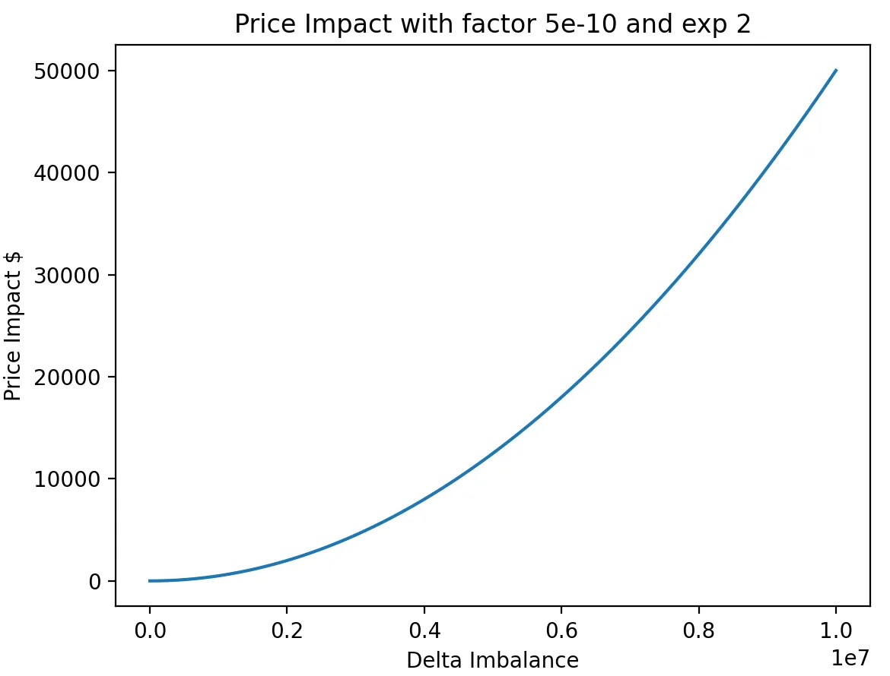
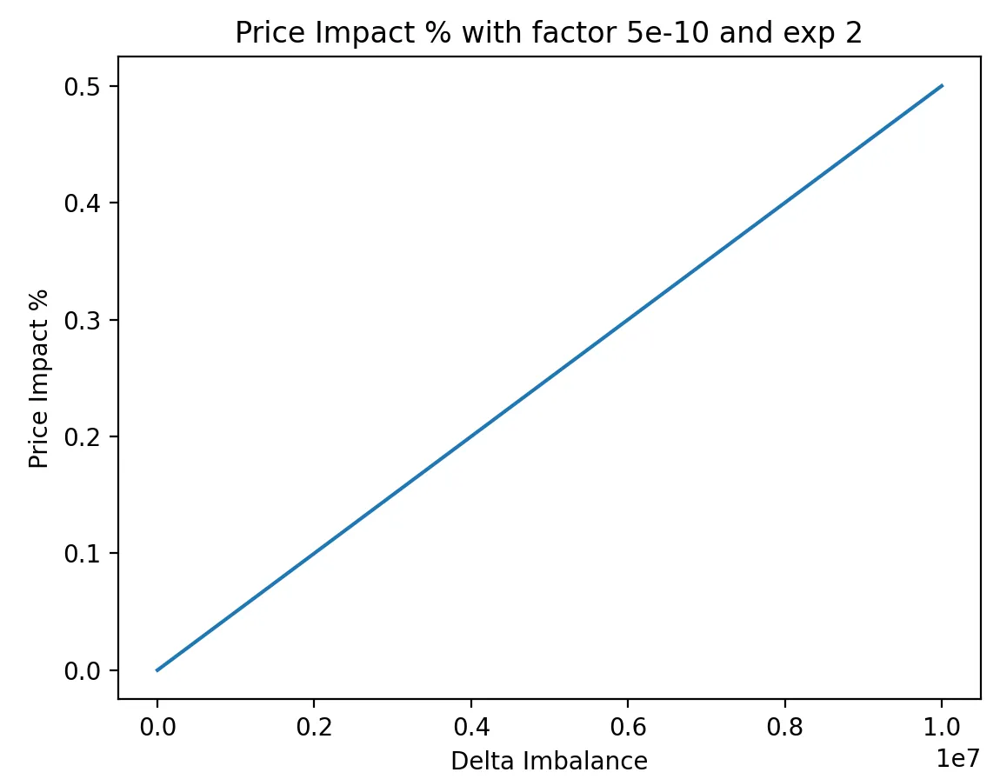

<head>
    <title>Understanding How Jupiter Perps Works: Complete Guide</title>
    <meta name="twitter:card" content="summary" />
</head>


Jupiter Perps is a **LP-based perpetual exchange** based on oracle prices.

Our pool consists of 5 tokens, **SOL**, **ETH**, **WBTC**, **USDC**, and **USDT**. Users acquire JLP by swapping on [Jupiter Swap](https://jup.ag/swap/USDC-JLP). Jupiter Swap automatically finds the cheapest way of acquiring JLP, by swapping to the desired asset and depositing that, or purchasing off the market.

Traders open leveraged positions by putting up collateral and borrowing
the rest of the position from the pool.

## Position Management

### Longs

Traders can open long positions or increase the size for existing positions for SOL, ETH, and wBTC with up to 100x leverage based on the initial margin (collateral).

#### Collateral Management

Traders can deposit or withdraw collateral from the position to manage the position's margin.

- When traders deposit collateral, the liquidation price and leverage for the long position decreases as the maintenance margin increases.
- When traders withdraw collateral, the liquidation price and leverage for the long position increases as the maintenance margin decreases.

#### Underlying Collateral

The underlying collateral for a long position is the token for the open position, as shown below:

| Position  | Collateral |
| --------- | ---------- |
| Long SOL  | SOL        |
| Long wETH | wETH       |
| Long wBTC | wBTC       |

Profits and collateral withdrawals are disbursed to traders in the token that is being longed.&#x20;

For example, a trader with a profit long SOL position will receive SOL when they close the position.

### Shorts

Traders can open short positions or decrease the size for existing positions for SOL, ETH, and wBTC with up to 100x leverage based on the initial margin (collateral).

#### Collateral Management

Traders can deposit or withdraw collateral from the position to manage the position's margin.

- When traders deposit collateral, the liquidation price and leverage for the short position increases as the maintenance margin increases.&#x20;
- When traders withdraw collateral, the liquidation price and leverage for the short position decreases as the maintenance margin decreases.

#### Underlying Collateral

The underlying collateral for a short position is either one of the USDC or USDT stablecoin, depending on the stablecoins' **utilization rates** at the time when the position is opened:

| Position   | Collateral  |
| ---------- | ----------- |
| Short SOL  | USDC / USDT |
| Short wETH | USDC / USDT |
| Short wBTC | USDC / USDT |

Profits and collateral withdrawals are paid out to traders in the stablecoin used as the underlying collateral for the position.

For example, a trader with a profitable short SOL position with USDC as the underlying collateral will receive USDC when they close the position or withdraw collateral.

### Limit Orders

Limit Orders operate independently from your existing positions.

- They remain active until either triggered at your specified price unless manually cancelled.
- If triggered, they will either:
  - Open a new position if you have no existing position.
  - Increase and combine with your existing position in that market.
- They stay active even if you close or get liquidated on an existing position.

:::warning Placing LO near Liquidation Price
Jupiter Perps does not enforce First-in, First-out (FIFO), meaning execution order is not strictly based on price priority. Instead, it depends on which transaction - your Limit Order (LO) or the liquidation transaction - gets processed first.

If you create a Limit Order at a price near your liquidation level, expecting it to save your existing position, the outcome is uncertain:
- If the Limit Order executes first = the position may be saved from liquidation
- If the Liquidation executes first = the existing position will be liquidated, but the Limit Order will remain active, potentially opening a new position immediately.
:::

:::warning Liquidation Price on Order Form
The liquidation price on the order form for a Limit Order will be the **simulated liquidation price** based on the position requested at the time when you fill in the order form.

- If you have an existing position = liquidation price includes existing position + current requested order
- If you have no existing position = liquidation price based on current requested order

**However, the liquidation price on the order form does not represent the liquidation price when the limit order is triggered and the position is opened.**
:::

:::info Limitation on Limit Orders
- The Perps V2 Beta does not support multiple limit orders **on the same pair and side**, please cancel the existing limit order before creating a new one.
- When the selected market's utilisation is above 80%, new limit orders cannot be created.
:::

#### Limit Price

When creating a Limit Order, you can set your desired entry price either above or below the current market price.

| Position Type | Limit Price Rules | Example |
|--------------|-------------------|----------------------------|
| Long | Max: 1% less than market<br/>Min: 50% of market price | Market: 100<br/>Max: 98<br/>Min: 50 |
| Short | Max: 1% more than market<br/>Min: 200% of market price | Market: 100<br/>Max: 102<br/>Min: 200 |


### Take-Profit / Stop-Loss Orders

An active Associate Token Account (ATA) is needed for TP/SL to be triggered and executed:
- ETH ATA for ETH-Long
- wBTC ATA for wBTC-Long
- USDC or USDT ATA for ALL Short positions

An ATA will be automatically created for you when you create a TP/SL.

Please note that the TP/SL will not be triggered if you close the respective ATA needed.

In the event of **manually closing a position**, the associated trigger orders will be automatically canceled and closed, providing a seamless experience when opening new future positions.

:::info
While `TP/SL` orders are set, keepers will monitor the mark price, when reaching the specified price level, TP/SL will close the whole position. More info on keepers [here](#keepers).
:::

### PnL

Profit and loss calculations directly corresponds to the size of your **position**. Here are two examples to illustrate this:

1. Long position example:
   * Position: 1,000 USD long on SOL
   * If SOL price increases by 10%: You profit 100 USD
   * If SOL price decreases by 10%: You lose 100 USD
2. Short position example:
   * Position: 1,000 USD short on SOL
   * If SOL price decreases by 10%: You profit 100 USD
   * If SOL price increases by 10%: You lose 100 USD

In both cases, the profit or loss is 10% of the **position size**, matching the percentage change in SOL's price.

#### Calculating realized and unrealized PnL

```
// 1) Get the current token price / exit price

exitPrice = currentTokenPrice

// 2) Determine if the position is profitable by checking if the exit price is greater than the position's
// average price for longs, or if the exit price is less than the position's average price for shorts

IF isLong THEN
    inProfit = exitPrice > positionAvgPrice
ELSE
    inProfit = exitPrice < positionAvgPrice

// 3) Calculate the absolute delta between the exit price and the position's average price

priceDelta = |exitPrice - positionAvgPrice|

// 4) Calculate the PnL delta for the closed portion of the position: multiply the size being closed (`tradeSizeUsd`) 
// by the price delta, then divide by the entry price to get the PnL delta

pnlDelta = (tradeSizeUsd * priceDelta) / positionAvgPrice

// 5) Calculate the final unrealized PnL depending on whether the position is profitable or not

IF inProfit THEN
    unrealizedPnl = pnlDelta
ELSE
    unrealizedPnl = -pnlDelta

// 6) Deduct the outstanding fees from the unrealized PnL to get the final realized PnL
// Read the `Fee` section below to understand how the fee calculations work
realizedPnl = unrealizedPnl - (closeBaseFee + priceImpactFee + borrowFee)
```

:::info
This [code snippet](https://github.com/julianfssen/jupiter-perps-anchor-idl-parsing/blob/main/src/examples/get-position-pnl.ts) shows an example of calculating a position's PNL programmatically.
:::

:::info
[Read the Jupiter Perpetuals fee breakdown here](#fees) for more info on open / close fees, price impact fees, and borrow fees.
:::

## Managing Leverage

### Leverage

To allow for leverage, traders borrow assets from the pool to create a larger position. To create a 2x long position SOL-USD, the other 1x SOL will be borrowed from the pool.

This borrow leads to an **hourly borrow rate** to be paid to the pool. Positions always pay [borrow fees](#borrow-fee) and are never paid funding.

This means actual leverage for a position will be slightly lower as the calculation takes into account all fees associated with maintaining the position.

### Auto Closing Positions that Exceed Maximum Leverage

The maximum allowed leverage is 500x.

Positions will be liquidated if the trader's collateral, after subtracting fees, adding unrealized profits and subtracting unrealized losses, is less than 0.2% of the position size.

:::info
When reducing the size of a position, the collateral amount is reduced as well to maintain the leverage for the position. For example, if a position has a 10x leverage, and reduces its size by 50%, the same amount of collateral will be withdrew from the position to maintain the 10x leverage.
:::

### Liquidation

The liquidation price for open positions represent the price at which the position will be automatically closed by the system to prevent further losses.

* For long positions:
  * Liquidation occurs when the current token price falls below the liquidation price
  * Example: If the liquidation price is $90, the long position will be closed if the token's price drops to $90 or lower.
* For short positions:
  * Liquidation occurs when the current token price rises above the liquidation price
  * Example: If the liquidation price is $110, the short position will be closed if the token price rises to $110 or higher.

The liquidation price can be calculated with the following formulas.

> * `price`: The average price (USD) of the position
> * `collateral_size`: The collateral size (USD) for the position
> * `close_fee`: The fee (USD) charged for closing the position
> * `borrow_fee`: The accumulated borrowing fees (USD) for maintaining a leveraged position
> * `size`: The size (USD) of the position
> * `max_lev`: The maximum allowed leverage (**500x** is the maximum allowed leverage in the Jupiter Perpetuals exchange for now)

**For long positions:**


**For short positions:**


:::info
It's crucial to note that the liquidation price is subject to change over time, particularly with leverage exceeding 10x and the accumulation of borrow fees over extended position durations. Regularly monitoring your liquidation price is essential. 

To mitigate the risk of liquidation, collateral adjustments and leverage fine-tuning can be performed through the `Edit` button in the position row, offering an avenue to add collateral and enhance the liquidation price.
:::

## Fees

There are 4 types of fees on Jupiter Perpetual:

1. A flat 0.06% (6bps) base fee, applied on notional position size.
2. A price impact fee, simulating the orderbook impact given notional size.
3. Borrow fee, paid hourly on open positions, based on notional size.
4. Transaction & Priority fee to create trade requests.

### Base Fee

A flat rate of **0.06%** of the position amount is charged when opening or closing a position. This base fee is also charged when a position is closed partially.

To calculate the base open or close for a trade:

```
BPS_POWER = 10^4      // 10_000

// 1. Get the base fee (BPS) from the JLP pool account's `fees.increasePositionBps` for open position requests
// or `fees.decreasePositionBps` for close position requests
// https://station.jup.ag/guides/perpetual-exchange/onchain-accounts#pool-account
   baseFeeBps = pool.fees.increasePositionBps

// 2. Convert `baseFeeBps` to decimals
   baseFeeBpsDecimals = baseFeeBps / BPS_POWER

// 3. Calculate the final open / close fee in USD by multiplying `baseFeeBpsDecimals` against the trade size
   openCloseFeeUsd = tradeSizeUsd * baseFeeBpsDecimals
```

:::info
This [code snippet](https://github.com/julianfssen/jupiter-perps-anchor-idl-parsing/blob/main/src/examples/get-open-close-base-fee.ts) contains an example on calculating open and close base fees programmatically.
:::

### Price Impact Fee

Large trades on the Jupiter Perpetuals exchange inherently **incur no price impact** since token prices are sourced from price oracles. While this is favourable for traders, it poses risks to the Jupiter Liquidity Pool (JLP):

1. Large, profitable trades can negatively impact the liquidity pool's reserves.
2. The platform becomes vulnerable to order manipulation.

To address these risks, Jupiter Perpetuals implements a dynamic price impact fee. This fee is designed to simulate trading conditions in traditional exchanges, where larger orders typically experience more price slippage due to limited liquidity at each price level.

The price impact fee is calculated dynamically based on how much a trade shifts the open interest imbalance:

1. For each market, we track the open interest imbalance (total size of long positions minus the total size of short positions).
2. We measure the change in this imbalance from one minute ago. We refer to this as the **delta imbalance**.
3. The price impact fee increases when the delta imbalance is higher (and decreases when it's lower). The calculation is:

```
Price Impact Fee = Base Fee + Factor × |Delta Imbalance| ^ Exponent
```

4. The **Factor** and **Exponent** parameters are adjusted periodically based on our metrics and discussions with our risk partners.

This price impact fee applies to both opening and closing positions, but not to liquidations.

The graphs below show a simulation of the total price impact fee (in dollar value and percentage) for a fixed set of parameters:




:::info
The max price impact fee percentage is set in the custody account in [`jump_rate_state.max_fee_bps`](guides/8-perpetual-exchange/3-onchain-accounts.md#custody-account), which means you will be charged this maximum percentage instead of having the price impact fee scale infinitely.
:::

**Benefits of the price impact fee:**

1. Trader incentives:
   * During sharp price movements, traders taking numerous one-sided positions will incur higher costs for opening their positions. This compensates for the undesirable delta imposed on the JLP.
   * Traders will not benefit from splitting positions across different trades or addresses, as positions must be opened quickly before their alpha decays.
2. Fair compensation for JLP holders:
   * The liquidity pool receives reasonable trading fees regardless of whether traders open large trades or split them up.
3. Orderbook simulation:
   * The fee structure mimics traditional order book dynamics, helping to prevent price manipulation.

:::info
Jupiter works with experts like [Chaos Labs](https://chaoslabs.xyz) to optimize the price impact fee and analyze its impact on the exchange. Consult [Chaos Labs' proposal and analysis on the dynamic price impact fee here](https://www.jupresear.ch/t/chaos-labs-price-impact-mechanism-proposal/25407) for additional information on calculating the price impact fee and other useful information.
:::

### Borrow Fee

On the Jupiter Perpetuals exchange, traders can open leveraged positions by borrowing assets from the liquidity pool.

Borrow fees serve two main purposes:

1. To compensate liquidity providers for the use of their assets.
2. To manage the risk associated with leveraged trading.

Unlike other perpetuals exchanges, the Jupiter Perpetuals exchange does not charge funding rates for open positions. Instead, traders pay borrow fees that compound hourly based on the borrowed amount for the leveraged position.

The borrow fees are reinvested back into the JLP pool to increase the pool's yield and available liquidity. It also acts as an incentive for the token mark price to align with it's market spot price.

Jupiter's hourly borrow fee is calculated using a dual slope model that adjusts based on the custody's utilization rates. For each custody, the model defines a target utilization level. When utilization is below the target level, the borrow rate is lower which incentivizes traders to borrow from the pool, thus increasing utilization and yield for the JLP. 

Once utilization exceeds the target level, the borrow rate increases aggressively. This higher rate serves two purposes: it incentivizes additional liquidity providers to enter the market, and it drives traders to reduce their positions as the higher borrowing costs outweigh potential returns. This dynamic approach ensures efficient liquidity allocation while preventing excessive leverage and overutilization of the JLP's assets.


#### Calculating Borrow Rate

The dual slope model uses four parameters to calculate the borrow rate:

* **Minimum rate**: The lowest borrow rate, applied at 0% utilization
* **Maximum rate**: The highest borrow rate, applied at 100% utilization
* **Target rate**: The borrow rate when utilization reaches its target level
* **Target utilization**: The optimal utilization level for the custody

:::info
Jupiter works with partners like Chaos Labs to set and optimize the parameters above. The parameters may be adjusted over time as market conditions change.
:::

:::info
The parameters above can be fetched onchain from the `min_rate_bps`, `max_rate_bps`, `target_rate_bps`, and `target_utilization_rate` fields via the [custody account's `jump_rate_state` field](https://station.jup.ag/guides/perpetual-exchange/onchain-accounts#custody-account).

The following research posts dive deeper into the methodology and technical details of the dual slope borrow rate model:

* https://www.jupresear.ch/t/gauntlet-dual-slope-borrowing-rate-model-implementation-and-recommendations-12-19-24/29072
* https://www.jupresear.ch/t/chaos-labs-borrowing-rate-jump-rate-model-recommendations/29203
:::

The borrow rate calculation depends on the current utilization level:

```
# First, calculate the slopes for both curves
lower_slope = (target_rate - minimum_rate) / target_utilization
upper_slope = (maximum_rate - target_rate) / (1 - target_utilization)

# Calculate the borrow rate based on current utilization
if utilization < target_utilization:
    # Below target utilization: Use gentler slope starting from minimum_rate
    borrow_rate = minimum_rate + (lower_slope * utilization)
else:
    # Above target utilization: Use steeper slope starting from target_rate
    borrow_rate = target_rate + (upper_slope * (utilization - target_utilization))
```

:::info
The borrow rate is calculated above is expressed as the annual rate (APR). To get the hourly borrow rate, divide the APR by 8,760 hours.
:::

#### Calculating Utilization Rate

To determine the current utilization rate, access the asset's on-chain account ([as shown here](https://station.jup.ag/guides/perpetual-exchange/onchain-accounts)) and apply the following calculation:

```
// Calculate utilization percentage
if (custody.assets.owned > 0 AND custody.assets.locked > 0) then
    utilizationPct = custody.assets.locked / custody.assets.owned
else
    utilizationPct = 0
```

#### Worked Example

Assume the borrow rate parameters are as below:

* `Minimum Rate`: 10%
* `Max Rate`: 230%
* `Target Rate`: 60%
* `Target Utilization`: 80%

Based on the formula above, we can obtain the upper slope and lower slope values for the dual slope borrow rate curve:

* `Lower Slope` = (60% - 10%) / 80% = 62.5%
* `Upper Slope` = (230% - 60%) / 20% = 850%

Assume the trader is opening a position with size **$10,000**.

#### Scenario 1: 40% Utilization (below target level)

* `Borrow Rate` = 10% + (62.5% × 40%) = 10% + 25% = 35%

The hourly borrow rate is calculated by dividing the borrow rate by the number of hours in a year:

* `Hourly Borrow Rate` = 35% / 8760 = ~0.004%

This means the position will accrue a borrow fee of `0.004% * $10,000 = $0.40` every hour.

#### Scenario 2: 90% Utilization (above target level)

Assume the current utilization rate is 85% which is above the target utilization level of 80% from the example above, the calculation is as follows:

* `Borrow Rate` = 60% + (850% × 10%) = 60% + 85% = 145%

The hourly borrow rate is calculated by dividing the borrow rate by the number of hours in a year:

* `Hourly Borrow Rate` = 145% / 8760 = ~0.0166%

This means the position will accrue a borrow fee of `0.0166% * $10,000 = $1.66` every hour.

:::info
Borrow fees are continuously accrued and deducted from your collateral. This ongoing deduction has two important consequences:

1. Your effective leverage increases over time as your collateral decreases.
2. Your liquidation price moves closer to the current market price.

It's crucial to regularly monitor your borrow fees and liquidation price. Failure to do so may result in unexpected liquidation, especially during periods of high market volatility or extended position duration.
:::

### How does the Jupiter Perpetuals contract calculate borrow fees?

Due to Solana's blockchain architecture, calculating funding fees in real-time for each position would be computationally expensive and impractical. Instead, the Jupiter Perpetuals contract uses a counter-based system to calculate borrow fees for open positions.

The [pool](https://station.jup.ag/guides/perpetual-exchange/onchain-accounts#pool-account) and [position](https://station.jup.ag/guides/perpetual-exchange/onchain-accounts#position-account) accounts maintain two key fields:

* The pool account maintains a global cumulative counter through its `fundingRateState.cumulativeInterestRate` field, which accumulates interest rates over time
* Each position account tracks its own `cumulativeInterestSnapshot` field, which captures the global counter's value whenever a trade is made: when the position is opened, when its size is increased, when collateral is deposited or withdrawn, or when the position is closed

To calculate a position's borrow fee, the contract takes the difference between the current global interest rate counter and the position's snapshot, then multiplies this by the position size. This approach enables efficient on-chain calculation of borrow fees over a given time period without needing real-time updates for each position.

The example below demonstrates the borrow fee calculation:

```
// Constants:
BPS_DECIMALS = 4             // 10^4, for basis points
DBPS_DECIMALS = 5            // 10^5, decimal basis points for precision
RATE_DECIMALS = 9            // 10^9, for funding rate calculations
USD_DECIMALS = 6             // 10^6, for USD amounts as per the USDC mint's decimals

// Main calculation:
1. Get the cumulative interest rate from the pool account:
   cumulativeInterestRate = pool.cumulative_interest_rate

2. Get the position's borrow rate snapshot:
   borrowRateSnapshot = position.cumulative_interest_snapshot

3. Get the position's borrow rate interval:
   borrowRate = cumulativeInterestRate - borrowRateSnapshot

4. Calculate final borrow fee (USD):
   borrowFeeUsd = (borrowRate * position.size_usd) / (10 ^ RATE_DECIMALS) / (10 ^ USD_DECIMALS)
```

:::info
This [code snippet](https://github.com/julianfssen/jupiter-perps-anchor-idl-parsing/blob/main/src/examples/get-borrow-fee.ts) shows an example of calculating a position's borrow fees programmatically.
:::

#### Funding rate

**There is no funding rate for Jupiter Perpetuals**. The Jupiter Perpetuals platform does not behave like a standard futures platform where longs pay shorts (or vice-versa) based on the funding rate, since traders borrow from the JLP which incurs a [borrow fee](#borrow-fee).

### Transaction & Priority Fee

Traders will have to pay SOL for submitting transactions onto the Solana chain. Traders also pay priority fees or Jito bundle tips (or both) depending on their settings.

At the same time, a minor SOL amount will be used for rent to create an escrow account ([PDA](https://solanacookbook.com/core-concepts/pdas.html#facts)). The SOL rent will be returned to you once you close your position.

## Example Trade

Suppose a trader wants to open a 2x long SOL position at a position size of $1000 USD by depositing $500 USD worth of SOL as a collateral and borrowing $500 USD worth of SOL from the pool. Assume the hourly borrow rate for SOL is **0.012%**.

| Initial Position Value | $1000 |
| --- | ----- |
| Initial Deposit | $500 |
| Borrowed Amount | $500 |
| Leverage | 2x |
| Initial SOL Price | $100 |
| Utilization Rate | 50% |
| Hourly Borrow Rate | 0.012% per hour |
| Position Opening Fee | `0.06% * $1000 = $0.6` |

The trader keeps this position open for 2 days, and the price of SOL appreciates by 10%.

| Final Position Value | $1100 |
| --- | ----- |
| Final SOL Price | $110 |
| Holding Period | 2 days (48 hours) |
| Position Closing Fee | `0.06% * $1100 = $0.66` |

The borrow fee accumulated throughout this period can be calculated as:

- `Hourly Borrow Fee = Tokens Borrowed/Tokens in the Pool * Hourly Borrow Rate * Position Size`
- `Total Borrow Fee = 50% * 0.012% * 1000 * 48 = $2.88 USD`

The trader's final profit can be calculated as:

- `Final Profit = Final Position Value - Initial Position Value - Borrow Fee - Opening Fee - Closing Fee`
- `$1100 - $1000 - $2.88 - $0.6 - $0.66 = $95.86`

The trader gets a final profit of **$95.86 USD** after this trade.

## Oracle

Jupiter Perps uses a new Oracle Network, Dove Oracle, co-designed by Jupiter and Chaos Labs and audited by Offside Labs.

The Dove Oracle relies on [Chaos' Edge Pricing Data](https://x.com/omeragoldberg/status/1834231003071774778) and anyone will be able to use it on Solana.

This oracle was co-designed with Jupiter, with the usage of Jupiter Perps in mind, and comes with key benefits while having an independent team provide the price feed.

This oracle is extremely compute-efficient, allowing us to update all 5 oracles (SOL, BTC, ETH, USDC, USDT) when opening and closing positions.


### Key Benefits
| Benefits | Old Oracle | Our Oracle |
| --- | ----- | ----- |
| Reliability | User makes a position request, Keepers wait for 45s for the oracle to update, if the oracle doesn't update, the position request fails. | User makes a trade, Keepers update the oracle and open the position with the same transaction. |
| Latency | User makes a request, Keepers have to wait for the oracle before placing the trade. | User makes a trade, Keepers immediately process the trade with the oracle. |
| Chart | Discrepancy between trades placed and the chart. | Our oracle powers the trading view chart and all position requests, no discrepancy. |

### Working Together With Pyth Oracle

Perp Keepers also utilize Pyth:

- As a reference price check (sanity check) against the Dove Oracle, ensuring that the deviation is not too big.
- As a fallback price if our oracle's prices are stale.

This way, Jupiter Perps benefits from the Dove oracle while still being able to rely on the Pyth oracle.

### Oracle Price Accounts and Fetching Oracle Prices

The Dove Oracle used by the Jupiter Perpetuals platform stores oracle price data in the following onchain accounts:

| Asset | Oracle Account |
|-------|----------------|
| SOL | [39cWjvHrpHNz2SbXv6ME4NPhqBDBd4KsjUYv5JkHEAJU](https://solscan.io/account/39cWjvHrpHNz2SbXv6ME4NPhqBDBd4KsjUYv5JkHEAJU) |
| ETH | [5URYohbPy32nxK1t3jAHVNfdWY2xTubHiFvLrE3VhXEp](https://solscan.io/account/5URYohbPy32nxK1t3jAHVNfdWY2xTubHiFvLrE3VhXEp) |
| BTC | [4HBbPx9QJdjJ7GUe6bsiJjGybvfpDhQMMPXP1UEa7VT5](https://solscan.io/account/4HBbPx9QJdjJ7GUe6bsiJjGybvfpDhQMMPXP1UEa7VT5) |
| USDC | [A28T5pKtscnhDo6C1Sz786Tup88aTjt8uyKewjVvPrGk](https://solscan.io/account/A28T5pKtscnhDo6C1Sz786Tup88aTjt8uyKewjVvPrGk) |
| USDT | [AGW7q2a3WxCzh5TB2Q6yNde1Nf41g3HLaaXdybz7cbBU](https://solscan.io/account/AGW7q2a3WxCzh5TB2Q6yNde1Nf41g3HLaaXdybz7cbBU) |

:::info
The code snippet below in the examples repo shows how to fetch and stream onchain price updates from the accounts above:

https://github.com/julianfssen/jupiter-perps-anchor-idl-parsing/blob/main/src/examples/poll-and-stream-oracle-price-updates.ts
:::

## Keepers

Jupiter Perpetual Exchange works based on a keeper model. A typical trader action involves a 2-step process:

1. **Trader** submits a request transaction onto the Solana chain.
2. **Keeper** monitors the request transaction and executes it as a separate transaction onto the Solana chain.

If the position request fails (e.g. if the oracle price is stale or the oracle price hits the trader slippage), the keeper will close the trader's request and return the SOL rent on the request and collateral (when opening a position) back to the trader. You will see this as a separate transaction on your wallet submitted by our keeper.

You may also notice multiple failed transactions on your wallet submitted by our keepers. You can safely ignore these failed transactions, they don't alter any state on your wallet. This happens because we have multiple keepers to execute your request in order to make sure that the trader experience is swift.

:::info
More information on Keepers can be found [here](./4-request-fulfillment-model.md).
:::
