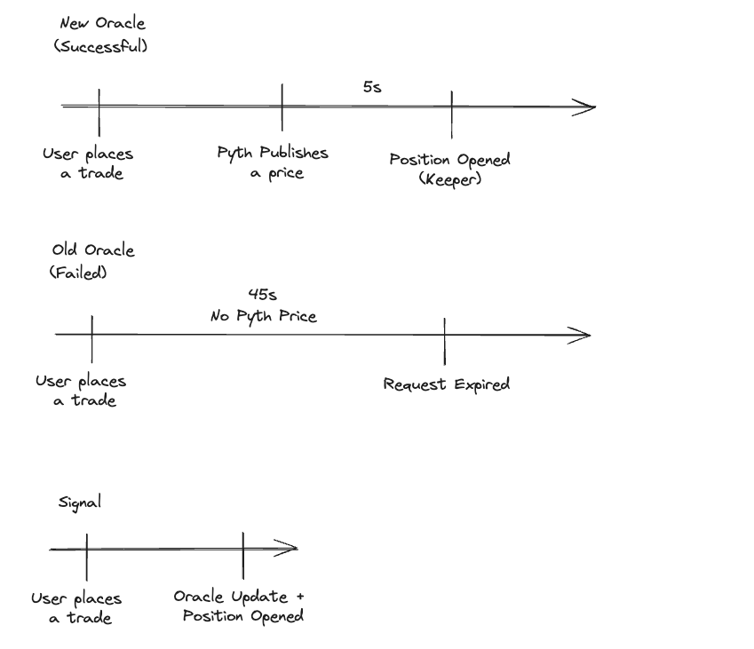

<head>
    <title>Understanding How Jupiter Perps Work: Complete Guide</title>
    <meta name="twitter:card" content="summary" />
</head>

# How It Works

## Overview

Jupiter Perps is a LP-based perpetual exchange based on oracle prices.

Our pool consists of 5 tokens, SOL, ETH, WBTC, USDC, and USDT. Users acquire JLP by swapping on [Jupiter Swap](https://jup.ag/swap/USDC-JLP). Jupiter Swap automatically finds the cheapest way of acquiring JLP, by swapping to the desired asset and depositing that, or purchasing off the market.

Traders open leveraged positions by putting up collateral and borrowing
the rest of the position from the pool.

## For Traders

### Example Trade

For example, a trader opens a 2x long SOL position at a position size of $100
USD by depositing $50 USD worth of SOL as collateral and borrowing $50 USD
worth of SOL from the pool.

Suppose the SOL price is up 20% when the position is closed. Assuming 0 fees,
the position will have gained $20 USD. The trader will receive $70 USD (50 + 20)
worth of SOL tokens and the rest of the tokens are returned to the pool.

Suppose instead that the SOL price is down 20% when the position is closed.
Assuming 0 fees, the position will have lost $20 USD. The trader will receive
$30 USD (50 - 20) worth of SOL tokens and the pool will get the remaining
tokens.

To open a long position, a trader deposits collateral matching the underlying
asset. For example, to open long SOL-USD position, the trader deposits SOL.

Conversely, to open a short position, a trader deposits collateral matching one
of the stablecoins in the pool.

### Leverage

To allow for leverage, traders borrow assets from the pool to create a
larger position. To create a 2x long position SOL-USD, the other 1x SOL will be
borrowed from the pool.

This borrow leads to a hourly borrow rate to be paid to the pool. Positions always pay borrow fees and are never paid funding.

### Hourly Borrow Rate

Traders pay an hourly borrow fee to the pool based on the hourly borrow rate, position size, and
token utilization percentage. This is computed for each token that a trader borrows.

`hourly borrow fee = tokens borrowed/tokens in the pool * hourly borrow rate * position size`

For example, suppose SOL is at 50% utilization and assuming an hourly funding
rate of 0.01%. Then a trader with a long position SOL-USD of size 1000 USD will
accumulate funding fees at a rate of 0.05 USD per hour.

### Auto Closing Positions that Exceed Maximum Leverage

The maximum allowed leverage is 500x.

Positions where the trader's collateral less fees and less unrealized losses is less than 0.2% of the position size will be liquidated.

### Oracle

Jupiter Perps uses a new Oracle Network, co-designed by Jupiter and another key ecosystem player (to be announced at Breakpoint), and audited by Offside Labs.

This new Oracle Network, known as Signal will be announced at Breakpoint.

This oracle is used as the mark price for opening and closing trades, calculating margin requirements, and triggering SL/TP orders and liquidations on the Jupiter platform.

This oracle was co-designed with Jupiter, with the usage of Jupiter Perps in mind, and comes with key benefits while having an independent team provide the price feed.

This oracle is extremely compute-efficient, allowing us to update all 5 oracles (SOL, BTC, ETH, USDC, USDT) when opening and closing positions.

Key Benefits
| Benefits | Old Oracle | Signal Oracle |
| --- | ----- | ----- |
| Reliability | User makes a position request, Keepers wait for 45s for the oracle to update, if the oracle doesnt update, the position request fails. | User makes a trade, Keepers update the oracle and open the position with the same transaction. |
| Latency | User makes a request, Keepers have to wait for the oracle before placing the trade. | User makes a trade, Keepers immediately process the trade with the oracle. |
| Chart | Discrepancy between trades placed and the chart. | Signal powers the trading view chart and all position requests, no discrepancy. |

### Pyth as a Fallback Oracle

Perp Keepers still use Pyth:

- As a reference price check (sanity check) against the Signal Oracle, ensuring that the deviation is not too big
- As a fallback price if Signal’s prices are stale.

This way, Jupiter Perps benefits from the new signal oracle while still relying on Pyth as a backup
