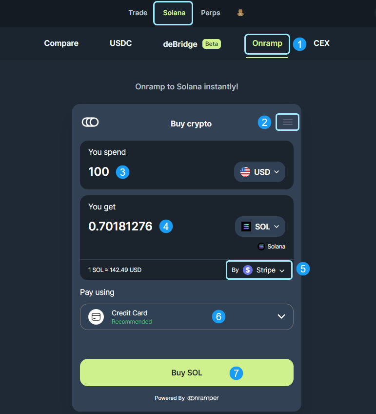

<head>
    <title>Asset On-ramps to Solana</title>
    <meta name="twitter:card" content="summary" />
</head>

Jupiter has integrated with Onramper to power a direct Onramp application from dirty fiat directly into the Solana asset of your choosing. 

Onramper is an on-ramp aggregator, helping users around the world get on-chain quickly and easily with the best prices. The Onramp application includes the top on-ramp services (Stripe, Banxa and Topper) to provide the best routing and options based on your region, desired amount and payment preference.

:::info
Jupiter will never charge any additional fees for using the Onramp service and Onramper is offering a reduced fee promotional period for the first six months of the integration. This reduced fee promotional period will end in December 2024.
:::

**Let's take a look at the Onramp App below.**

---

## Onramp UI

1. **Onramp App Selector:** Selector to navigate to the Onramp application.
2. **Options Menu:** Select your language preferences, review the Terms of Usage and Privacy Policy, and find Help & Support here. 
3. **You Spend:** Selector to choose the currency and input the amount you would like to spend on your purchase.
4. **You Get:** Selector to choose the Solana asset and the output amount of that asset you will get for your input spend amount.
5. **Payment Processor Selector:** Select your preferred payment processor to complete the Onramp purchase.
6. **Pay Using:** A dropdown to choose the payment method to use for the purchase. This includes credit, debit, Apple Pay, Google Pay and ACH options.
7. **Buy Button:** Click this to begin the Onramp purchase transaction.

Once you click `Buy Button`, a new tab will open for you to complete the transaction through the payment processor's site with the inputs specified above.

---

## CEX Transfers to Solana

Transferring assets to Solana has never been easier. If you are looking to transfer assets from a Centralized Exchange (CEX), please refer to the steps provided [here](https://jup.ag/bridge/cex). Each CEX can have different requirements for external transfers, so please refer to their respective Guide as well.
