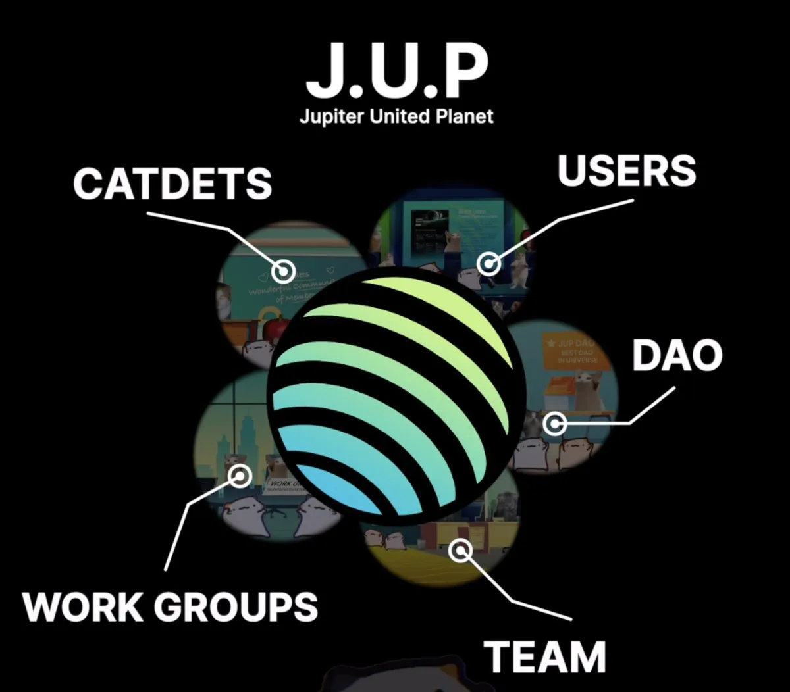
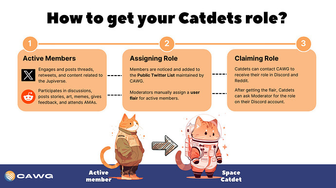

<head>
    <title>Jupiverse: The J.U.P</title>
    <meta name="twitter:card" content="summary" />
</head>

The J.U.P is Jupiter’s vision for a multi-pronged community which works in tandem to move both Jupiter and the crypto space forward. It is made up of users, the team, the DAO, Catdets and Working Groups.

:::tip Meow's Community Note on The J.U.P
[All of these groups together form the full J.U.P, and you can read more about this concept here](https://www.jupresear.ch/t/j-u-p-an-experiment-in-distributed-strategic-execution/7182).
:::

---

## What are Catdets?

Catdets are the most active members of the Jupiter community who are consistently helpful and dedicated to uplifting others in the J.U.P.

You can recognize them by their red colored role in the [Discord server](https://discord.gg/jup), but the role is not exclusively limited to Discord. You can also become a Catdet by contributing and helping others in platforms such as [Reddit](https://www.reddit.com/r/jupiterexchange/), [Twitter](https://x.com/jup_dao), or through [real life interactions like activations](https://x.com/0xSoju/status/1859145404585308503).

## Morphing into a Catdet

- Be active in chats
- Try helping new users
- Embrace the [Catdet Ethos](https://catdets.jup.eco/docs/who-is-a-catdet/ethos), and become a true pillar of the Jupiter community. Over time, you will become noticed and people will recommend you for the role. 

To learn more about becoming a Catdet, either reference the image below or browse the official website: https://catdets.jup.eco/

