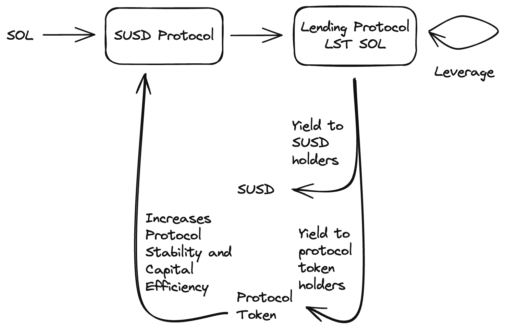

This litepaper introduces SUSD, a native Solana yield-bearing stablecoin protocol backed by SOL liquid staking tokens (LSTs) with dynamic leverage to supercharge yield for holders of SUSD.

## Introduction

Current popular stablecoins such as USDC, USDT are plagued by multiple levels of custodian and regulatory risks. In addition, there are unfair levels of risks for holders of these fiat backed centralized stablecoins, granting centralized issuers full autonomy on investment decisions, risking fiat-deposits without distributing the yield generated to holders of these stablecoin - the actual risk bearers.

While other various decentralized stablecoins such as DAI by Maker generates yield from Real-World assets, introducing additional risk vectors, XYZ aims to solve these problems by introducing an overcollateralized fully decentralized stablecoin, SUSD, backed by SOL LSTs while channeling proof-of-stake yield back to the actual risk-bearers - individuals and organizations holding SUSD.

## Use Cases / Benefits
- Interest-free loans - Unlike typical lending protocols where borrowers are charged an interest, XYZ allows borrowers to act as minters of SUSD by using SOL as collateral. Yields generated from staked SOL covers the cost of the loan resulting in a perpetually interest-free loan while maintaining the upside of SOL.
- Fully decentralized stablecoin native to Solana to power Solana’s DeFi ecosystem
- Earn stablecoin yield

## Leveraged Yield
POS yield is generated through LSTs and redirected to stablecoin holders and potentially protocol token holders. To further increase the yield, leverage on LST is achieved through recursively borrowing SOL by collateralizing SOL LSTs at various lending protocols. The level of leverage is dynamically adjusted according to the SOL lending rate and LST yield. In the event SOL lending rates spike, resulting in a net 0 additional yield, no leverage is used. The projected yield is 7% ~ 17% with an average yield of 10~12% in a healthy market condition.

Since SOL LSTs are effectively staked SOL, the price ratio of SOL LSTs to SOL remains relatively stable through various market conditions. This allows for low levels of liquidation risks. The primary risk factors are oracle attacks and potential exploits of the LST protocols used. This risk is managed and minimized through diversifying across various audited LST protocols with dynamic leverage enabling rapid but progressive deleveraging to preserve collateral used should a blackswan event occur.

## Maintaining Peg
SUSD is backed by overcollateralized SOL, however, due to market forces, the value of SUSD can vary. Through various market conditions, there is a natural economic incentive for market makers to restore the value of SUSD back to 1 USD / SUSD.

When the value of SUSD is above USD 1, there are arbitrage opportunities by minting SUSD via SOL to be sold at market prices for a profit, this selling pressure restores the value of SUSD back to 1.

Conversely, when the value of SUSD is below USD 1, minters of SUSD have the incentive to repay their loans for cheap, since the loans are denominated in SUSD. Repayment of loans introduces buy pressure on SUSD in the open market which restores the peg of SUSD back to 1. (see additional mechanisms below for additional approaches to maintaining SUSD peg)

## Liquidations
Minters of SUSD opens a loan position with an initial collateralization ratio of 130%. In the event, the value of the collateral drops below the minimum collateralization of 110%, a progressive liquidation event occurs, allowing anyone to participate in restoring the position back to a healthy ratio by repaying SUSD to improve the collateralization ratio while earning a portion of the position’s collateral as a fee.

## Mechanics
SUSD is an overcollateralized stablecoin minted in a permissionless manner by depositing SOL. With the deposited SOL, the protocol converts it to SOL LSTs with leverage via lending protocols to maximize yield generated for holders of SUSD.

### Minting SUSD

Users are allowed to mint up to an initial collateralization ratio of 130% while maintaining a minimum collateral ratio of 110% to prevent liquidation.

This effectively allows a user to take ~76.9% (100 / 1.3) loan.

For e.g. SOL price is $10 and the user uses 10 SOL as collateral, the total value of collateral is $100, the user can have a maximum loan of ~76.90 SUSD calculated as (10 SOL x $10) / 1.3.

In the event SOL price drops ~15% below $8.459 (76.9 * 1.1 / 10), the user’s collateral is at stake of liquidation to bring the loan ratio back above the minimum collateral ratio of 110%.

We propose the initial and minimum collateral ratio of 130% and 110% to eventually be decided by a DAO. This collateral ratio should be sufficiently high to maintain protocol stability and ensure sufficient collateral backing stablecoins minted in extreme market conditions.

A minimal minting fee (amount yet-to-be determined) is charged to cover the cost of converting SOL to leveraged SOL LST.

### Protocol Leverage

The proposed protocol leverage is used to provide yield to stablecoin holders, and allow SUSD minters interest-free loans. This yield is derived from POS staking through LSTs, hence offering a reasonably stable and sustainable yield. We propose the use of leverage to increase yield further.

Leverage is achieved through lending protocols by collateralizing LST SOL to borrow SOL, which in turn is swapped to LST SOL, performed repeatedly until desired leverage factor is achieved. Effectively, this works as an interest rate arbitrage and remains profitable as long as the borrow rate is lower than the yield derived from LSTs. Liquidation risk is minimal since the price of collateral and the price of the debt token has a correlation factor of close to 1.

A dynamic leverage of 1 ~ 3x is used and adjusted according to liquidity available as well as borrow rate. The primary factor used to determine leverage is borrow rate. As the borrowing rate goes up, the yield goes down. Once borrow rate goes above PoS yield, leverage is no longer justified. Rather than deleveraging all at once, we take a progressive approach to deleveraging.

A proposed permissionless keeper design will perform the transactions to leverage or deleverage dynamically. The keeper is a simple infinite loop process that monitors the protocol SOL vault, performing leverage when excess SOL is within the vault and deleveraging as new requests for SOL redemptions are being made.

#### The Leverage Process
1. When a user deposits SOL to mint SUSD, the SOL is transferred to the protocol’s vault.
1. When a keeper script detects excess SOL in this vault, the keeper:
    - Initiates a CPI call to either swap or stake the SOL in exchange for LST SOL
    - The LST SOL will then be deposited into lending vaults as collateral
    - A debt positioning, borrowing SOL will be opened
    - The SOL is then repeatedly swapped / staked for LST SOL and deposited as collateral to borrow more SOL to maximize collateral in LST SOL against a debt in SOL

#### The Cost of Leveraging
When SOL is converted to LST, the keeper should automatically look for routes to get the maximum amount of SOL either through swapping through dexes or directly staking it with a LST protocol. There should be no additional cost associated with leveraging

#### The Deleveraging process

1. Deleveraging has to occur whenever a user is attempting to withdraw SOL collateral or when a SUSD position needs to be liquidated or redeemed against.
1. After a request for SOL has been submitted on-chain, the keeper sees the request and withdraws LST SOL to be converted back to SOL recursively up to the desired amount. There are 2 primary ways to convert LST SOL to SOL - swapping or unstaking. The keeper will always prefer swapping if the rates are equal to the output amount through unstaking given the instant nature of swap.

#### The Cost of Deleveraging
Converting LST SOL to SOL via unstaking incurs a 0.1% fee. Since, we propose a maximum leverage of 3x, this fee has to be multiplied by 3 or 0.3%. This fee will be borne by users who mint SUSD.

### Loan Repayment

Users can redeem their amount of SOL deposited (net minting fee) as long as their position stays above the minimum collateralization ratio.

In order to redeem more or their entire net SOL deposited, they would have to repay a portion or their entire SUSD loan position to improve their debt-to-collateralization ratio. When debt becomes 0, they would be able to redeem their entire net SOL deposited.

### User Liquidation
XYZ protocol mints SUSD with an overcollateralization of SOL such that 1 SUSD is always backed by > $1.1 worth of SOL. In order to maintain the collateralization level, each user’s position will need to be within the minimum collateralization ratio of 110% as introduced above. Should a user’s position go below the minimum collateralization ratio, liquidators are entitled to perform liquidation by repaying SUSD on the user’s position until the position is brought back to 110% collateral ratio. Liquidators are awarded 1% additional SOL for liquidation.

## Additional Mechanisms
### Stablecoin Peg Redemptions

The core importance of maintaining a SUSD peg of $1 can be achieved through permissionless redemption. Separate to user-position liquidations, our proposed mechanism allows for anyone to perform a redemption of 1 SUSD against $1 worth of SOL. This creates an economic incentive for market makers to purchase SUSD from the open market when the price of SUSD goes below $1 to be redeemed against $1 worth of SOL.

Redemption is performed against users’ position. The user’s position with the highest debt-to-collateral ratio will first be redeemed against. Redemption creates a natural economic incentive to restore the peg of SUSD back to $1 through buy pressure on SUSD from the open market.

### Stablecoin Peg via Protocol Token

While redemptions are an effective way to maintain the peg of SUSD, there are undesirable effects for SUSD minters who can be redeemed against even with a healthy debt-to-collateral ratio. To reduce the occurrence of redemption against users’ SOL and to minimize the impact on minter should this occur, we propose the introduction of a XYZ protocol token that can be redeemed against when the price of SUSD is within -5% of $1. (The -5% is arbitrary and can be voted on by the DAO.) This effectively allows market makers to purchase SUSD from the open market for < $1 and redeem $1 worth of the XYZ protocol token.

In addition to the buy pressure on SUSD by market makers, this 5% tolerance also creates a time buffer for minters to repay their debt at a lower than face value given that their debt is denominated in SUSD without losing collateral. This would further increase buy pressure on SUSD to restore the peg.

In order to achieve this, the protocol token will need to be value accruing or deflationary. This can be achieved through directing a portion of the yield generated from leveraging LST to XYZ protocol token holders or through a burning mechanism.

It is important to highlight that the proposal of redemption against XYZ protocol token should not be mistakenly associated with the idea of having SUSD backed by the protocol token. SUSD is ultimately backed by minters’ SOL. The redemption of SOL will still occur if SUSD depegs below $0.95 (-5% threshold) and the protocol will always be overcollateralized with > $1.1 worth of SOL for every SUSD minted. The protocol token is only used to improve the capital efficiency of the protocol by allowing minters to maintain a higher debt-to-collateral ratio with lower risks of redemption prior to liquidation while also effectively maintaining the peg of SUSD through natural economic incentives.
